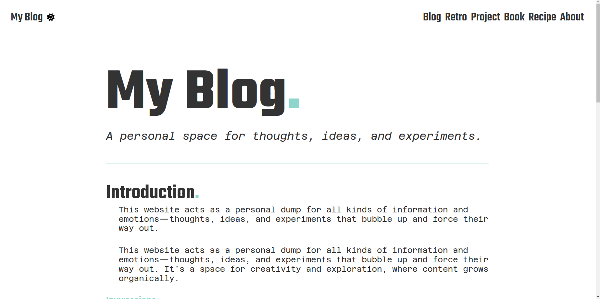

<h1 align=center>Hugo Pillow Theme<br><a href="https://pillowbeast.github.io/hugo-pillow/" rel="nofollow">Demo</a></h1>
<h2 align=center>🌟 Modern | 🌙 Minimal | 📱 Fully Responsive</h2>
<br>

**ExampleSite** can be found here: [**exampleSite**](https://github.com/pillowbeast/hugo-pillow/). The demo is built using this example configuration.

[](https://github.com/gohugoio/hugo/releases/tag/v0.88.0)
[](https://github.com/pillowbeast/hugo-pillow/blob/main/LICENSE)


---
<br>
<p align="center">
</p>

---

# Get Started

To get started with using the theme we start by creating a new hugo page. 
After that we initialize our git repository and add the theme as a submodule.
Finally we copy the `hugo.toml` to the root of the new hugo page.

```bash
hugo new site <mynewhugopage>
cd <mynewhugopage>
git init
git submodule add <url> themes/hugo-pillow
cp themes/hugo-pillow/hugo.toml .
hugo server
```

# Configuration

You can change a lot of the theme's settings in the `hugo.toml` file.
- primary,secondarycolor
- contact information
- social media links
- ...

# Content

The following types of content are supported:
- blog
- projects
- retrospectives
- about
- recipes
- books

You can find examples of each in the `content` folder of the exampleSite.

# Shortcodes

The following shortcodes are available:
- gallery
- metadata
- recipe
- bulletpoints
- quotes
- inline-images